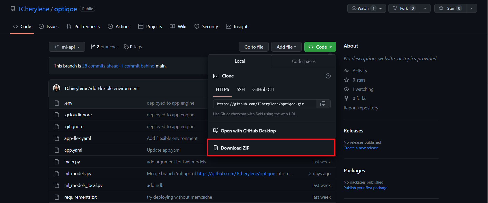
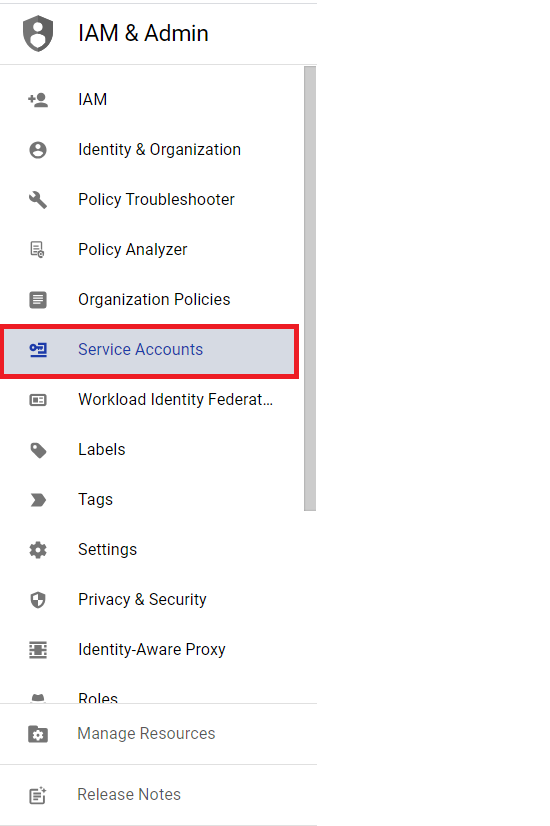
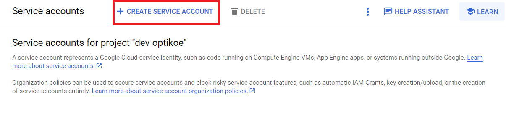
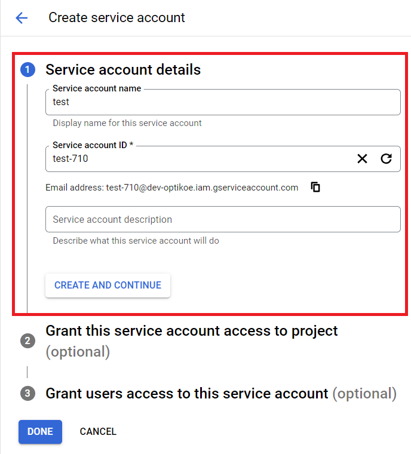
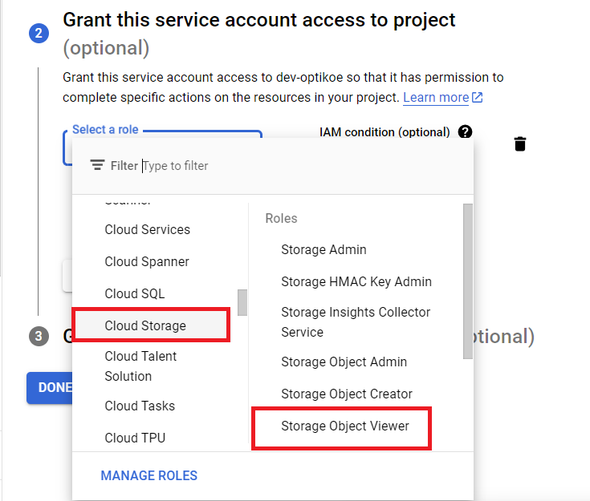
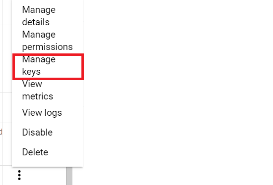
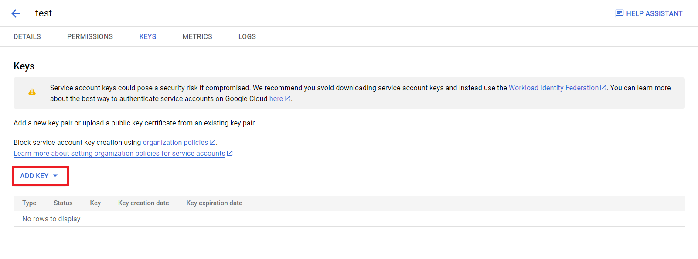
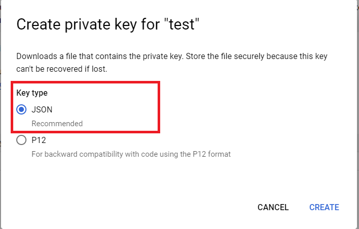

# Optiqoe
---
This is repository of ML API for Capstone Bangkit 2023. We are from Team ID C23-PS096 and our team member:
1. (ML) M181DSX0179 – Bintang Gabriel Hutabarat – Universitas Indonesia - [Active]
2. (ML) M181DSX0344 – Farhan Hanif Saefuddin – Universitas Indonesia - [Active]
3. (ML) M017DKX3924 – Steven Alexander Liong – Institut Teknologi Bandung - [Active]
4. (CC)  C038DSX0738 – Haffif Rasya Fauzi – Institut Teknologi Sepuluh Nopember - [Active]
5. (CC) C038DSY0684 – Cherylene Trevina – Institut Teknologi Sepuluh Nopember - [Active]
6. (MD) A305DSX3540 – Irnanda Rizka Fadhillah – Universitas Pembangunan Nasional Veteran Jawa Timur  - [Active]

For our team link can be access at: `https://api-dot-dev-optikoe.et.r.appspot.com/`
<br>

## Install the Requirements
---
For run this program, you must install the library. this are dependencies or libraries required for the application:

```
keras  == 2.12.0 
tensorflow == 2.12.0
numpy == 1.23.5
google-cloud-storage == 2.9.0
Flask == 2.3.2
pillow == 9.5.0
gunicorn == 20.1.0
python-dotenv == 1.0.0
# appengine-python-standard == 1.1.2
```

Apart from the method above, there is another way, namely cloning a repository in a way that will be explained in the next section.

## Clone the Repository
---
You run the application by clone from github. Here are the steps:

```
git clone -b ml-api https://github.com/TCherylene/optiqoe.git
```

or you can download the file by click code in right and Download the Zip.


Next step is you must install the requirements using this command:

```
pip install -r requirements.txt
```

And make sure everything has been installed successfully. if it is successful then you can proceed to the next step.

## Prepare the Service Account for Deploy on GCP
---
Before carrying out the deployment stage on Google Cloud Platform (GCP). The thing that must be prepared is to generate a service account. This is necessary to grant the necessary permissions to the application so that users can interact with those resources.

This are steps for generate the service account:
1. Go to page of IAM & Admin.
2. Next, choose menu of Services Accounts.

3. After that, select create service account.

4. Fill service account name and service account id. Then click continue.

5. On Grant this service account access select role `storage object viewer`.

6. Click Done for create service account.

After the step completed. You must generate the key. This are steps you can follow to generate the key:
1. Select the name and email from the service account that was previously created.
2. Then, select manage the key on three dots. 

3. On page of manage the key, click add key.

4. After that, select Create new key and key type on format json.

5. Click create and private key will download to my local computer.

From all steps above, it used for read AI Models from the the bucket.

## Config app.yaml and wsgi.py Files
---
from app.yaml file:

```
runtime: python
service: api
entrypoint: gunicorn wsgi:application

env: flex

runtime_config:
  operating_system: ubuntu22

manual_scaling: 
  instances: 2

resources:
  cpu: 1
  memory_gb: 6
  disk_size_gb: 16

handlers:
- url: /.*
  script: auto

env_variables:
  CREDENTIALS: 'ml-model-read.json'
  BUCKET_NAME: 'optikoe-ml-models'
  MODEL_PATH: 'face_type_model.h5'
  FLASK_ENV: 'production'

```

- `runtime: python` and `service: api` : It's use python runtime with services name api.
- `entrypoint: gunicorn wsgi:application` : Our team uses Gunicorn as the HTTP server and wsgi:application indicates the WSGI application object.
- `env: flex` : The application should be deployed in the flexible environment.
- `runtime_config` : This section allows additional configuration for the runtime. In this case, it specifies the operating system as Ubuntu 22.
- `manual_scaling` : In this case, we set to 2 instances for the number of instances to run the application.
- `resources` : It specifies 1 CPU, 6GB of memory, and 16GB of disk size for each instance.
- `handlers` : Any URL pattern (`/.*`) will be handled by the specified script automatically.
- `env_variables` :  It sets the values for various environment variables such as CREDENTIALS, BUCKET_NAME, MODEL_PATH, and FLASK_ENV.


then, on wsgi.py files is used to create an instance of the Flask application that can be used by the WSGI server.

```
from main import app
application = app
```

- `from main import app` : In this context, `main` refers to a Python file (usually named `main.py`) that contains the Flask application.
- `application = app` : By assigning the Flask app object to application, the WSGI server can correctly interact with the Flask application.

## Deploy on Google Cloud Platform
---
For deploy on GCP, first, you must open google cloud console and ensure you have account. This are steps for deploy on google cloud.
1. First, open the terminal.
2. Do the clone repository step as in the previous session.
3. Next, the enter the directory with command `cd` on terminal.
4. After that, upload the private key that was previously created in the project repository.
5. Then, ensure the private key already exists. And do deploy with command:

```
gcloud app deploy --region asia-southeast2
```

6. Click authorize and select the option `Y`.
7. This process will wait several minutes.
8. Finally, after process has been finished, app engine will generate the link.

## Endpoint Optiqoe Application for ML
---

### Home
---
Endpoint: `GET {{baseurl}}/`
Body Request : -
Authorization : -

Contoh respon:
```
{
    "message": "Hello, flask!!",
    "status": 200
}
```

### Kacamata
---
Endpoint: `GET {{baseurl}}/kacamata`
Body Request : -
Authorization : -

Contoh respon:
```
{
    "message": "Endpoint called",
    "status": 200
}
```

Endpoint: `POST {{baseurl}}/kacamata`
Body Request : image file
Authorization : -

Contoh respon:
```
{
    "data": {
        "kacamata_shape": "Rectangle",
        "probability": 0.9999997615814209
    },
    "message": "Success",
    "status": 200
}
```

### Face
---
Endpoint: `GET {{baseurl}}/face`
Body Request : -
Authorization : -

Contoh respon:
```
{
    "message": "Endpoint called",
    "status": 200
}
```

Endpoint: `POST {{baseurl}}/face`
Body Request : image file
Authorization : -

Contoh respon:
```
{
    "data": {
        "face_shape": "Round",
        "probability": 0.4136110544204712
    },
    "message": "Success",
    "status": 200
}
```