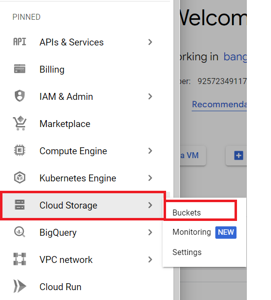
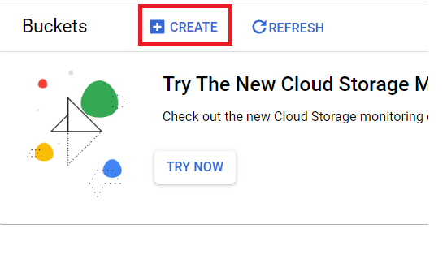
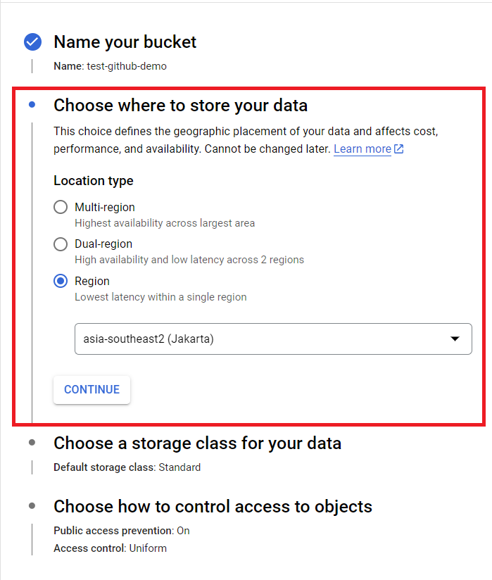
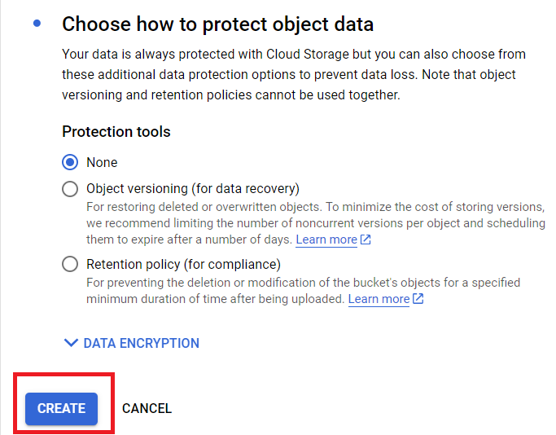
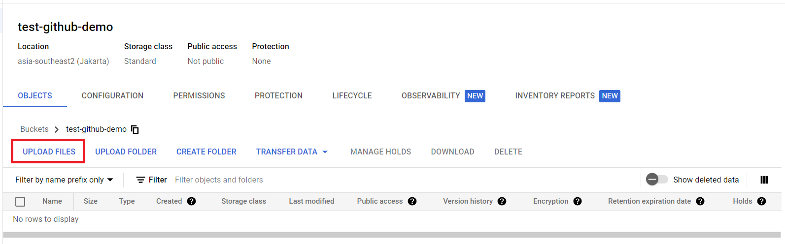
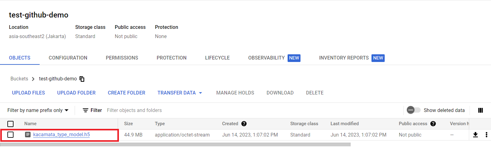

# Optiqoe
---
This is repository of ML API for Capstone Bangkit 2023. We are from Team ID C23-PS096 and our team member:
1. (ML) M181DSX0179 – Bintang Gabriel Hutabarat – Universitas Indonesia
2. (ML) M181DSX0344 – Farhan Hanif Saefuddin – Universitas Indonesia
3. (ML) M017DKX3924 – Steven Alexander Liong – Institut Teknologi Bandung
4. (CC)  C038DSX0738 – Haffif Rasya Fauzi – Institut Teknologi Sepuluh Nopember
5. (CC) C038DSY0684 – Cherylene Trevina – Institut Teknologi Sepuluh Nopember
6. (MD) A305DSX3540 – Irnanda Rizka Fadhillah – Universitas Pembangunan Nasional Veteran Jawa Timur

## Install the Requirements
---

[Gunicorn](https://gunicorn.org/) (Green Unicorn) is a WSGI compliant web server for Python Applications that receive requests sent to the Web Server from a Client and forwards them onto the Python applications or Web Frameworks (such as Flask or Django) in order to run the appropriate application code for the request.

You can install `gunicorn` using command `sudo apt-get update && sudo apt-get install gunicorn`.

## Steps to deploy

### Clone the Repository
---

Run the application by cloning the github. Here are the steps:

```
git clone -b ml-api https://github.com/TCherylene/optiqoe.git
```

or you can download the file by click code in right and Download the Zip.


Next step, install the requirements using this command:

```
pip install -r requirements.txt
```

### Prepare the Service Account for Deploying on GCP
---
Before carrying out the deployment stage on Google Cloud Platform (GCP). The thing that must be prepared is to generate a service account. This is necessary to grant the necessary permissions to the application so that users can interact with those resources.

This are steps for generate the service account:
1. Go to page of IAM & Admin.
2. Next, choose menu of Services Accounts.

3. After that, select create service account.

4. Fill service account name and service account id. Then click continue.

5. On Grant this service account access select role `storage object viewer`.

6. Click Done for create service account.

After the step completed. You must generate the key. This are steps you can follow to generate the key:
1. Select the name and email from the service account that was previously created.
2. Then, select manage the key on three dots. 

3. On page of manage the key, click add key.

4. After that, select Create new key and key type on format json.

5. Click create and private key will download to my local computer.

From all steps above, it used for read AI Models from the the bucket.

### Upload Model to Bucket
---
To be able to run the application, one of the aspects that must be considered is uploading the model to the Bucket. Here are the steps:
1. Go to Google Storage page and choose Bucket Menu.

2. Then, click `create` bucket. <br>

3. Fill unique name the bucket and click continue.
4. Next, select `location type` on region and choose asia-southeast2 (jakarta)

5. After that, follow the default setting and click create
 
6. We will wait several minutes to generate the bucket.
7. Then, click upload files to upload model.

8. Upload will take a minutes. And finally model has been uploaded.
   

### Configuring app.yaml and wsgi.py Files
---
from app-flex.yaml file:

```
runtime: python
service: api
entrypoint: gunicorn wsgi:application

env: flex

runtime_config:
  operating_system: ubuntu22

manual_scaling: 
  instances: 2

resources:
  cpu: 1
  memory_gb: 6
  disk_size_gb: 16

handlers:
- url: /.*
  script: auto

env_variables:
  CREDENTIALS: 'ml-model-read.json'
  BUCKET_NAME: 'optikoe-ml-models'
  MODEL_PATH: 'face_type_model.h5'
  FLASK_ENV: 'production'

```

- `runtime: python` and `service: api` : It's use python runtime with services name api.
- `entrypoint: gunicorn wsgi:application` : Our team uses Gunicorn as the HTTP server and wsgi:application indicates the WSGI application object.
- `env: flex` : The application should be deployed in the flexible environment.
- `runtime_config` : This section allows additional configuration for the runtime. In this case, it specifies the operating system as Ubuntu 22.
- `manual_scaling` : In this case, we set to 2 instances for the number of instances to run the application.
- `resources` : It specifies 1 CPU, 6GB of memory, and 16GB of disk size for each instance.
- `handlers` : Any URL pattern (`/.*`) will be handled by the specified script automatically.
- `env_variables` :  It sets the values for various environment variables such as CREDENTIALS, BUCKET_NAME, MODEL_PATH, and FLASK_ENV.


`wsgi.py` is used to create an instance of the Flask application that can be used by the WSGI server.

```
from main import app
application = app
```

- `from main import app` : In this context, `main` refers to a Python file (named `main.py`) that contains the Flask application.
- `application = app` : By assigning the Flask app object to variable `application`, the WSGI server can correctly interact with the Flask application.

### Deploy on Google Cloud Platform
---
For deploy on GCP, first, you must open google cloud console and ensure you have account. This are steps for deploy on google cloud.
1. First, open the terminal.
2. Clone the repository as mentioned in the [previous section](#clone-the-repository).
3. Next, the enter the directory with command `cd foldername` on terminal.
4. After that, upload the private key that was previously [created in the project repository](#prepare-the-service-account-for-deploying-on-gcp).
5.  Make sure we already in the right project where you wanna upload the project using `gcloud config set project <project_id>
6. Specify the region where you want to deploy. Our team use `asia-southeast2` as the region. Use command: `gcloud config set compute/region asia-southeast2`
7. Then, ensure the private key already exists. And do deploy with command:

```
gcloud app deploy app-flex.yaml
```

You can change the `app-flex.yaml` based on your yaml file. You don't need to specify the file if the name is `app.yaml`

8. If prompted, click authorize and select the option `Y`.
9. This process will take several minutes.
10. Finally, after process has been finished, app engine will generate the link. The link will be written as `{{baseurl}}` in the following API documentation.

## Optiqoe API for ML Predictions
---

### Home
---
Endpoint: `GET {{baseurl}}/` <br>
Body Request : - <br>
Authorization : - <br>

Contoh respon:
```
{
    "message": "Hello, flask!!",
    "status": 200
}
```

### Kacamata
---

#### GET Method
---
Endpoint: `GET {{baseurl}}/kacamata` <br>
Body Request : - <br>
Authorization : - <br>

Contoh respon:
```
{
    "message": "Endpoint called",
    "status": 200
}
```

#### POST Method
---

Endpoint: `POST {{baseurl}}/kacamata` <br>
Body Request : image file <br>
Authorization : - <br>

Contoh respon:
```
{
    "data": {
        "kacamata_shape": "Rectangle",
        "probability": 0.9999997615814209
    },
    "message": "Success",
    "status": 200
}
```

### Face
---
#### GET Method
---
Endpoint: `GET {{baseurl}}/face` <br>
Body Request : - <br>
Authorization : - <br>

Contoh respon:
```
{
    "message": "Endpoint called",
    "status": 200
}
```

#### POST Method
---
Endpoint: `POST {{baseurl}}/face` <br>
Body Request : image file <br>
Authorization : - <br>

Contoh respon:
```
{
    "data": {
        "face_shape": "Round",
        "probability": 0.4136110544204712
    },
    "message": "Success",
    "status": 200
}
```
